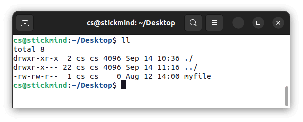

# 文件操作


Linux 提供了许多命令用于查看文件的内容、创建新文件或空文件、更改文件的时间戳以及移动、删除和重命名文件或目录。这些命令可以用于管理数据和文件，并确保在正确的位置提供正确的数据。在本节中，我们将学习如何管理文件。

## 查看文件


| 命令       | 用途                                                                           |
| ---------- | ------------------------------------------------------------------------------ |
| **`cat`**  | 用于查看不太长的文件，不提供页面操作                                           |
| **`tac`**  | 逆序打印文件内容                                                               |
| **`less`** | 用于查看较大的文件，提供页面操作，操作逻辑类似 `vi` 编辑器                     |
| **`tail`** | 默认打印文件后 10 行内容，通过参数 **`-n 15`** 或 **`-15`** 可以改变显示的行数 |
| **`head`** | 和 **`tail`** 命令相反，默认打印文件前 10 行内容                               |

_**补充**：`vi` 编辑器使用 **`j`** 向下滚动，**`k`** 向上滚动，使用 **`/`** 向后查找，使用 **`?`** 向前查找。_

## 文件的创建

`touch` 命令常用于更新文件的状态，默认修改文件时间戳为当前时间。不过，我们也可以使用该命令创建一个空白文件：

```
touch myfile
```

更多功能可以查询帮助，比如使用 `-t` 可以设定具体的时间戳。以下命令将文件时间设置为 8 月 12 日 14 点整：

```
touch -t 08121400 myfile
```

{align=center}

## 文件移动、重命名等

`mv` 命令可以实现两个功能：

- 重命名文件或文件夹
- 移动文件到另一个目录

如果不确定删除哪些文件，可以是用 `-i` 交互操作。

| 命令        | 用途         |
| ----------- | ------------ |
| **`mv`**    | 重命名文件   |
| **`rm`**    | 删除文件     |
| **`rm –f`** | 强制删除文件 |
| **`rm –i`** | 交互删除文件 |

## 文件夹创建和删除

`mkdir` 命令用于创建目录文件夹，例如，在当前目录创建文件夹可以使用

```
mkdir myfolder
```

在指定目录创建文件夹可以使用

```
mkdir ~/Desktop/myfolder
```

删除文件夹可以使用 `rmdir` 命令，默认只能删除空文件夹。使用命令 `rm -rf` 可以快速简单地递归删除整个文件夹。

| 命令         | 用途           |
| ------------ | -------------- |
| **`mv`**     | 重命名文件夹     |
| **`rmdir`**  | 删除空白文件夹 |
| **`rm -rf`** | 强制删除文件夹 |

## 修改命令行提示符

命令行工具通过变量 `PS1` 存储命令行的文本字符串，一般 Linux 发行版会默认设置一个值，例如：

```
cs@stickmind:~$ 
```

通过修改该变量，可以定制显示的内容：

```
PS1="cs102@virtualbox: "
```

命令提示符将修改为：

```
cs102@virtualbox: 
```

**注意**，在终端直接赋值变量名，仅在当前激活的终端有效。重新打开终端，变量内容仍然是默认值。如果我们想永久修改该变量，可以尝试在 `.bashrc` 中进行设置。

## 练习
 
1. 使用 `touch` 创建两个文件 `file1` 和 `file2`
2. 使用 `ls -l` 检查文件状态
3. 将 `file1` 重命名为 `new_file1`
4. 将 `file2` 移动到上级目录
5. 删除 `file2` 和 `new_file1`
6. 创建文件夹 `dir1`
7. 删除 `dir1`
