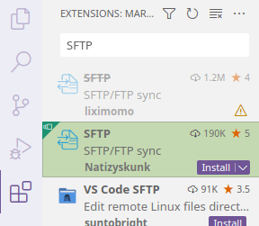
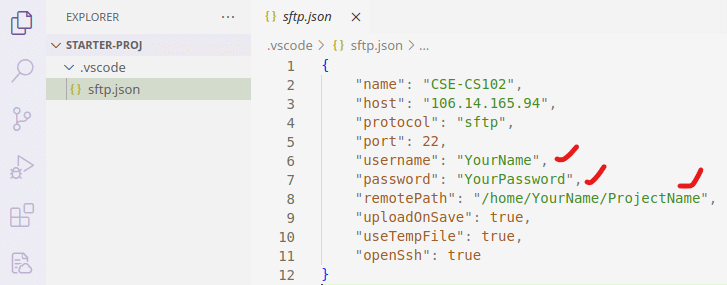
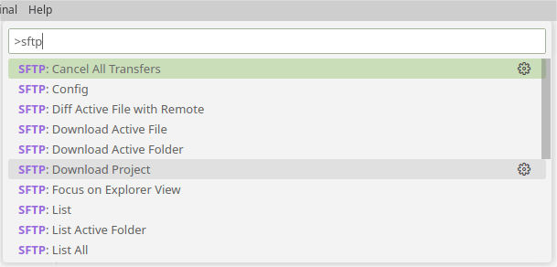

# 实验 0：上手 Linux 开发环境

本课程采用了远程 Linux 云端服务器与命令行工具作为开发环境，仅需结合本地终端及 Visual Studio Code（VS Code），即可圆满完成所有实践练习。

本次实验旨在引导大家熟悉远程开发的整个流程。实验结束时，你应能成功连接到课程的远程服务器，并熟练运用终端命令，在 VS Code 中进行高效的代码编辑。

```{admonition} 为什么使用远程服务器进行开发？
:class: note

回溯至上世纪 80 年代，即便电脑近在咫尺，我们也需借助终端方能与之交互。时至今日，尽管个人计算机已取得了长足进步，图形界面亦日趋完善，但在实际的开发环境中，终端操作依然占据核心地位。众多前后端框架、开源项目及开发工具，均深度依赖于终端指令。

本课程致力于模拟此类真实的开发情境。当你未来有幸踏入软件公司的门槛，你会发现，在此所学的技能将为你带来难以估量的价值。
```

## 登录课程云服务器

服务器 IP 地址为 `121.41.65.84`，你只需在任何支持 SSH 命令的计算机终端中输入以下指令即可连接。

- 对于 Windows 11 用户，系统已预装 Windows Terminal 供你使用。
- 而 Linux 及 macOS 用户，则可直接利用内置的 Terminal 进行操作。

```
ssh YourName@121.41.65.84
```

首次使用时，系统会弹出一个确认提示。此时，请输入 `yes` 进行确认，并紧接着输入服务器的用户密码（请注意，在输入密码的过程中，屏幕上不会显示任何字符以保护你的隐私）。一旦验证成功，你将会看到如下输出信息：

```
The authenticity of host '121.41.65.84 (121.41.65.84)' can't be established.
ED25519 key fingerprint is SHA256:LHvn4qDvTdM1+GcJtG2f+uywxDA2JSys.
This key is not known by any other names
Are you sure you want to continue connecting (yes/no/[fingerprint])? yes

Warning: Permanently added '121.41.65.84' (ED25519) to the list of known hosts.
YourName@121.41.65.84's password:

Welcome to Ubuntu 22.04.1 LTS (GNU/Linux 5.15.0-52-generic x86_64)
```

常用服务器信息查询命令概览

- **查看主机名**：使用 `hostname` 命令可以获取当前服务器的主机名称。
- **查看当前用户名**：通过 `whoami` 命令，你可以确认当前登录的用户身份。
- **检查硬盘空间**：执行 `df -h` 命令（需 root 权限）能够直观地查看服务器的硬盘使用情况及剩余空间（以人类可读的格式显示）。
- **查看内存状态**：`free -h` 命令将为你提供服务器内存的当前使用状况概览，包括已用、空闲及交换空间等信息（同样以人类可读的格式）。
- **当前文件夹空间使用情况**：利用 `du --max-depth=1 -h` 命令，你可以快速了解当前目录下各子目录及文件的磁盘占用情况（限制显示深度为 1 层，并以人类可读的格式展示）。
- **修改登录密码**：若需更改你的登录密码，请运行 `passwd` 命令，并按照提示操作即可。

## 基于 SFTP 远程开发工作流

成功通过命令行登录服务器，意味着你的计算机已配备了诸如 SSH 等工具。为了提升开发效率，你可以借助广受欢迎的 VS Code 文本编辑器来辅助代码的编辑与项目代码的同步。

```{admonition} 为什么本课程不推荐使用 VS Code 官方 Remote 插件？
:class: note

原因在于，一旦你通过官方 Remote 插件连接到服务器，VS Code 会在你的 `home` 目录下持续生成名为 `.vscode-server` 的冗余文件。在极端情况下，这些文件可能会占据高达数 GB 的磁盘空间，从而对你的服务器性能造成显著影响。

此外，官方 Remote 插件的内存占用也相对较高，每位用户都可能消耗掉数百 MB 的内存资源。

鉴于这种高昂的资源消耗，即便是国内外各大高校自建的校内服务器，也难以承受其带来的压力。

*参考：[Copies of vscode-server installed on school servers take up excessive storage and RAM](https://github.com/microsoft/vscode-remote-release/issues/6429)*
```

## 安装 SFTP 插件

在 VS Code 的插件市场中，请搜索 “SFTP”，并从中选择并安装由 Natizyskunk 开发的 SFTP 插件，具体安装步骤及界面如图所示。

{align=center}

## 配置 SFTP 插件

完成插件安装后，你可以使用本课程提供的初始项目文件 `starter-proj.zip`（[点击下载](./assets/starter-proj.zip)）。该项目已预先配置了 VS Code 与 SFTP 的框架。请解压该文件，并使用 VS Code 打开解压后的 `starter-proj` 文件夹。接下来，在 `.vscode` 文件夹内找到并编辑 `sftp.json` 文件，以修改以下关键信息：

- `username`：请填写你的服务器用户名。
- `password`：请输入你的服务器密码。
- `remotePath`：请指定你在服务器上希望编辑的项目路径，例如 `/home/xuehao/cs102/lab0/`。

{align=center}

## 使用 SFTP 插件

```{admonition} 注意
:class: attention

根据之前配置的`remotePath`，你需要在服务器上预先创建好相应的目录，才能继续后续的操作步骤。
```

配置完成后，你可以通过点击 VS Code 菜单栏中的 “Help” 选项，并选择 “Show All Commands” 来查找所有命令。在弹出的命令列表中，搜索 “SFTP” 相关命令。选择 “SFTP: Download Project”，随后系统会提示你选择默认的保存位置。完成选择后，远程服务器上的项目将会自动下载到本地的初始项目文件夹中。

{align=center}

当你在本地对文件进行编辑并保存后，SFTP 插件会智能地将更新后的文件自动同步至远程服务器。至于编译、测试、调试等开发任务，则完全可以通过远程服务器的终端（Terminal）来执行。

```{admonition} 小技巧
:class: tip

**添加文件**
:  若你在本地或服务器上首次创建项目文件时，SFTP 插件不会自动进行同步。在这种情况下，你可以手动选择 “SFTP: Sync Remote -> Local” 或 “SFTP: Sync Local -> Remote” 命令来确保文件在本地与服务器之间正确同步。

**删除文件**
:  值得注意的是，在删除文件方面存在特殊情况。上述的同步命令并不适用于删除操作。若你需要删除某个文件，则必须在本地和服务器上分别执行手动删除。
```

```{admonition} 重要
:class: important

如果不小心使用 VS Code 官方远程插件，可以使用 `ls -a` 命令查看你的服务器目录，此时你会发现一个 `.vscode-server` 文件夹。

可以使用 `rm -r .vscode-server` 命令删除该目录。
```


```{admonition} 危险
:class: danger

严禁使用 Jetbrains Clion/Fleet 连接服务器！一旦连接，此类开发工具会在服务器上下载超过 2 GB 的 Java 依赖。
```

[^1]: [终端](https://wiki.mbalib.com/wiki/%E7%BB%88%E7%AB%AF%EF%BC%88%E8%AE%A1%E7%AE%97%E6%9C%BA%EF%BC%89)是一台电子计算机或者计算机系统，用来让用户输入数据，及显示其计算结果的机器。

