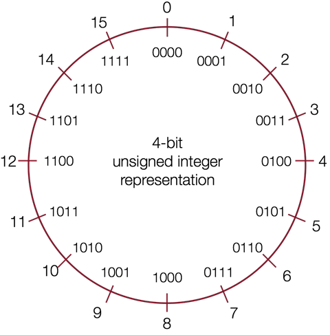
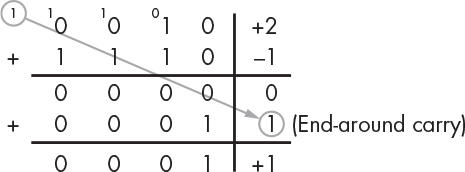
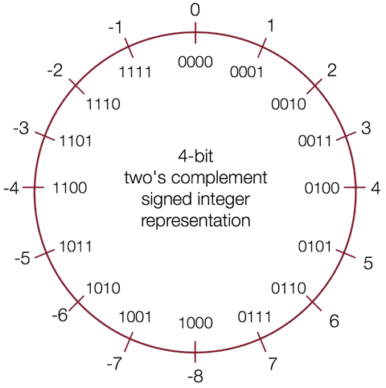

# 整数的表示

```{toctree}
:hidden:

index2
```

在计算机中，数字的表示可以大致分为三类，分别是：

- 无符号整型（unsigned integer）：表示正数和 0，例如 $0$，$1$，$2$，……，$255$
- 有符号整型（signed integer）：表示正数、负数和 0，例如 $-128$，$-127$，……，$0$，$1$，$2$
- 浮点数（floating point number）：表示实数，例如 $3.14$，$1.5*10^{12}$

在 C 语言中分别有对应的基本数据类型用于表示这些数字：

| Types  | Bytes（32 Bit） | Bytes（64 Bit） |
| :------: | :---------------: | :---------------: |
| `char`   | 1               | 1               |
| `short`  | 2               | 2               |
| `int`    | 4               | 4               |
| `long`   | 4               | 8               |
| `float`  | 4               | 4               |
| `double` | 8               | 8               |
| `char*`  | 4               | 8               |

32 位和 64 位代表计算机的**字长**（word size），表示指针的大小。虚拟地址是以字来编码的，所以字长决定了计算机虚拟地址空间的大小。对于 32 位系统来说，能够支持的最大虚拟地址空间为 4 GB。

目前，大部分计算设备都已经从 32 位迁移到 64 位，但在嵌入式领域这些转变才刚刚开始。以树莓派为首的嵌入式平台，已经开启了 64 位转移之路，推荐阅读：

- [It's official: Raspberry Pi OS goes 64-bit](https://www.jeffgeerling.com/blog/2022/its-official-raspberry-pi-os-goes-64-bit)
- [CS107E: Computer Systems from the Ground Up](http://cs107e.github.io/)

## 无符号整型

无符号整型只能表示 0 和正数，不可以表示负数。

无符号整型的二进制表示可以直接隐射到十进制数，例如：

$$0b0001 = 0 * 2^3 + 0 * 2^2 + 0 * 2^1 + 1 * 2^0 = 0 + 0 + 0 + 1 = 1 $$
$$0b0101 = 0 * 2^3 + 1 * 2^2 + 0 * 2^1 + 1 * 2^0 = 0 + 4 + 0 + 1 = 5 $$
$$0b1011 = 1 * 2^3 + 0 * 2^2 + 1 * 2^1 + 1 * 2^0 = 8 + 0 + 2 + 1 = 11$$ 
$$0b1111 = 1 * 2^3 + 1 * 2^2 + 1 * 2^1 + 1 * 2^0 = 8 + 4 + 2 + 1 = 15$$

如果用 $w$ 表示位的个数，那么无符号整型能够表示的范围是 $0$ 到 $2^{w}-1$，所以 C 语言中 int 能够表示的数字范围是 $0$ 到 $4,294,967,295$。

下图通过数字轮盘形象地表示了无符号整型的二进制表示和十进制数字之间的关系，以及无符号整型能够表示的数字范围：

{align=center}

## 有符号整型

有符号整型可以表示 0，正数和负数。

既然要表示负数，那么首先需要解决的问题是：如何通过二进制位表示正或负？

目前的解决方案是通过保留一个符号位（最高位）来区分正和负，这个位称为**最高有效位** MSB（most significant bit）。

### 1s 的补码

通过将正数的所有二进制位进行反转来表示对应的负数，我们可以得到 1s 的补码表示（ones' complement ）。

这个命名的由来是基于这样的一个事实，对应的正负数相加可以得到全为 1 的二进制位。例如 -1 和 1 相加的二进制位是 1111。

1s 的补码的缺点是有两个用于表示 0 的不同位模式，造成了不必要的浪费。另外，在进行加法操作时，如果进位超过了总体位数，则需要进行循环进位（end-around carry）。例如，

{align=center}

目前，1s 的补码表示在数字信号处理领域依然有大量的应用。

### 2s 的补码

如果我们想避免循环进位，可以对反转后的位额外进行一次加 1 操作，那么我们就得到了 2s 的补码表示（two's complement ）。

例如，+1 二进制表示为 0001，反转后的结果是 1110，然后再进行加 1 操作得到 1111 用于表示 -1；同样，+2 二进制表示为 0010，反转后的结果是 1101，然后再进行加 1 操作得到 1110 用于表示 -2。

下图通过数字轮盘形象地表示了 2s 的补码表示的有符号整型的二进制表示和十进制数字之间的关系，以及有符号整型能够表示的数字范围：

{align=center}

2s 的补码表示是基数补码（Radix Complement）的一个应用。2s 的补码定义可以表述为一个 N 位表示的值的补码，是该值相对于 $2^N$ 的补码。

名称中的 2 可以理解为 $2^N$，例如 4 个位表示的数字系统，$2^N = 16 = 10000$，那么 +5 的补码就是 -5 ，因为 0101(+5) + 1011(-5) = 10000；这样的结果对于其他互补的值同样成立。

2s 的补码表示除了看起复杂，但却有很多优点。

- 对应的正负数相加的结果依然是 0。

    ```
      0101 (+5)         1111  (-1)
    + 1011 (-5)       + 0001  (+1)
      ======            ======
      0000 (0)          0000  (0)
    ```

- 只有一个位模式用于表示 0，避免了浪费。
- 最高有效位 MSB 依然可以用于表示正负号。
- 加法操作逻辑更简单，可以用于任意的正负数组合，不需要循环进位。

    ```
      0010 (+2)         0100  (+4)           0100  (+4)
    + 1011 (-5)       - 0101  (+5)  -->>   + 1011  (-5)
      ======            ======               ======
      1101 (-3)         ????  (??)           1111  (-1)
    ```

```{admonition} 小技巧：对于二进制表示的数字，如何快速找到其对应的正/负值？
:class: tip 

从右向左，找到第一个 1，将左侧剩下的位全部反转即可。

例如，+2 的位模式为 00<span style="color:red">1</span>0，那么将第一个 1 左侧所有位反转可以得到 <span style="color:blue">11</span><span style="color:red">1</span>0，即为 -2。
```
