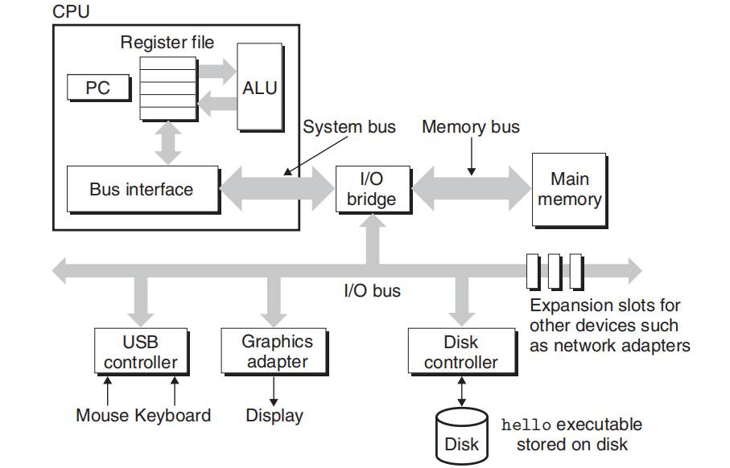

# 汇编语言


```{toctree}
:hidden:

topic_5/asm_intro/index
topic_5/x86-64_asm/index
topic_5/asm_tools/index
topic_5/lab_5/index
topic_5/assign_5/index
```

本阶段主要目标是学习计算机如何解释并执行 C 程序。回答这个问题可以帮助我们更好地理解：

- 程序是如何真实地转换成计算机可以识别的指令并执行的，从而帮助我们编写更好的程序
- 学习程序的逆向工程，并在汇编级别开发程序


C 是更高级别的编程语言，可以在不同机器之间移植，但并不是用于执行程序的抽象级别。了解程序是如何编译并执行的以及计算机体系结构，是编写高性能程序的关键（例如，代码行数少并不一定更好）。

GCC 将我们的代码编译成 CPU 可以执行的机器代码指令。同时，CPU 还使用寄存器和 `mov` 等指令来处理数据。

除此之外，我们还可以在汇编级别进行逆向工程来开发程序！


