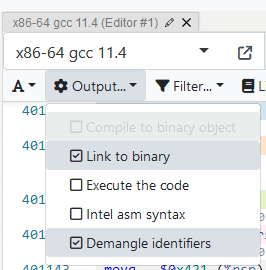

# 实验 5：汇编和运行时栈

本次实验将进一步理解 C 语言和汇编之间的关系，同时还会练习使用反汇编工具 `objdump`，以及使用 GDB 进行调试汇编程序和函数调用栈，并能够将函数栈帧与运行时程序的状态联系起来。这些内容对程序调试非常有用。

理解 C 代码与其汇编指令之间的关系，以及从汇编到 C 的逆向工程练习，可以为下一次作业做好充分的准备。

以下一些问题用于检测你的理解，并让你进一步思考这些概念：

- 举一个 C 表达式的例子，可以编译成不同但却等效的汇编指令。
- `sar` 和 `shr` 之间有什么区别？
- 函数的返回值是如何从被调函数传递给主调函数的？
- 什么样的行为可能表明 `lea` 指令是在进行地址计算，而不是算术运算？
- 如果变量在 `gdb` 报告中显示 `<optimized out>`，如果获得该变量的值？
- 为什么用于函数参数的寄存器是完全固定的，但对于本地变量（local variable）却没有任何约定的位置？
- 为什么要区分 **caller-owned** 寄存器和 **callee-owned** 寄存器？相比于不作区分，这种设计的优势是什么？
- 如何根据给定的汇编代码为函数绘制栈帧图。

## 学习目标

- 练习使用 GDB 调试汇编代码
- 学习 C 源码和汇编转换的关系
- 观察并理解运行时栈的执行机制
- 分析运行时栈相关的错误

## 初始代码

你的个人用户目录下应该已经有 `cs102` 这个文件夹了，通过下面的命令拷贝初始代码到该目录中：

```Shell
cp -r /home/cs102-shared/labs/lab5 ~/cs102
```

```{admonition} 提示
:class: hint

初始项目内置了一些陷阱，如果编译过程中报告了错误，这属于正常情况，不必担心。
```

## 任务 1：GDB 调试汇编

一起练习一下 GDB 汇编相关的命令。

1. 通读 `code.c` 程序代码。
2. 编译程序并使用 `gdb` 进行调试。反汇编出 `myfn` 函数的汇编指令。
3. 使用反汇编找出 `arr` 的存储位置（提示：查看第一个 `mov` 指令，`%rsp` 是指向当前栈顶的指针）。`arr` 中的值是如何初始化的？初始化最后一个数组元素时，对字符串常量进行的 `strlen` 调用发生了什么？
4. 对 `count` 进行赋值的时候，生成了哪些指令？关于 `sizeof` 运算符，我们能得出什么结论？汇编指令会调用实际的函数吗？
5. 在函数 `myfn` 处设置断点并运行程序。使用命令 `info locals` 显示局部变量。将此列表与 C 源代码中的声明进行比较。你会看到一些变量显示“实时”的值，另一些却只显示 `<optimized out>`。
6. 尝试在汇编层面调试，找出哪个寄存器存储了 `total` 的值，哪个寄存器存储了 `squared` 的值？注意，寄存器可以被多个变量进行复用。

## 任务 2：汇编指令练习

学习 C 到汇编的转换，建议尝试 Compiler Explorer 在线工具，这是一款便利的“交互式编译器”。

此[链接](https://godbolt.org/z/o831K37hd)参照课程和实验中的 `Makefile` 编译器标志，已经预先为你配置好。如果想手动配置自己环境：语言选择 C，编译器版本选择 `x86-64 gcc 11.4` 并输入标志 `-Og -std=gnu99`。如果想得到和服务器上一致的编译结果，可以勾选“Link to binary”和“Demangle identifiers”两个选项。

{align=center}

在 Compiler Explorer 中，你可以输入 C 函数，查看其生成的汇编代码。调整 C 的源代码后，可以观察这些更改如何反映在汇编指令中。你可以在服务器上使用 `gcc` 和 `gdb` 进行相同的观察，但 Compiler Explorer 提供了一个方便的测试环境，可以更轻松地完成这些任务。试试看吧！

### 移动和地址模式

打开 Compiler Explorer 提前写好的代码[链接](https://godbolt.org/z/5GvbEe6Yc)，查看下面两个 `deref` 函数的汇编代码。

```c
void deref_one(char* ptr, long index) {
    *ptr = '\0';
}

void deref_two(int* ptr, long index) {
    *ptr = 0;
}
```

- 花点时间通读 `mov` 指令。该指令在做什么？它与其所代表的 C 代码有何联系？
- 这两个函数的汇编指令序列有一处不同。不同之处是什么？为什么会有这个差别？
- 编辑这两个函数，使用 `ptr[7]` 替换 `*ptr`。这会如何改变 `mov` 指令目标操作数的寻址模式？两个 `deref` 函数是否以相同的方式变化？
- 再次编辑这两个函数，使用 `ptr[index]` 替换 `ptr[7]`。这会如何改变 `mov` 指令目标操作数的寻址模式？两个 `deref` 函数是否以相同的方式变化？
- 将整个赋值语句更改为 `ptr[0] = ptr[1]`。对于这两个函数，汇编代码都增加了一条指令。上述所有操作，都只需要一条 `mov` 指令。该赋值语句却需要两个 `mov`。为什么？


```{admonition} 补充
:class: note

你可能会疑惑，为什么只需要移动一个字节，编译器却使用了 `movzbl` 指令。在这种情况下，虽然移动一个字节是可行的，但编译器会做出选择，它认为这样可以使程序的执行更高效。

参考阅读[指令级别的并行处理](https://en.wikipedia.org/wiki/Register_renaming)。
```

打开 Compiler Explorer 提前写好的代码[链接](https://godbolt.org/z/bxhdbGae4)，查看下面两个 `deref` 函数的汇编代码。

```c
typedef struct coord {
    int x;
    int y;
} coord;

void deref_three(struct coord* ptr) {
    ptr->x = ptr->y;
}

void deref_two(int* ptr, long index) {
    ptr[0] = ptr[1];
}
```

- 花点时间阅读 `mov` 指令。它做了什么？它与其所代表的 C 代码有何联系？
- `deref_third` 与 `deref_two` 的汇编指令完全相同，但是这两个函数的 C 源代码似乎彼此无关！为什么生成了相同的汇编指令？

### 整型算术运算

接下来探索一下汇编中的算术运算。`add`、`subl` 和 `imul` 指令分别执行加法、减法和乘法。以下是这些指令的格式：

```asm
add src, dst       # dst += src
sub src, dst       # dst -= src
imul src, dst      # dst *= src
```

以下两个函数对其参数执行相同的算术运算，但这些参数的类型（符号）不同：

```c
int signed_arithmetic(int a, int b) {
    return (a - b) * a;
}

unsigned int unsigned_arithmetic(unsigned int a, unsigned int b) {
    return (a - b) * a;
}
```

打开 Compiler Explorer 提前写好的代码[链接](https://godbolt.org/z/b9TMdTM1Y)，查看两个函数的汇编代码。

- 两个函数生成相同的汇编指令序列！由此可见，2 的补码表示允许 `add/sub/imul` 指令同时适用于无符号和有符号两种类型。非常聪明的设计！
- 编辑这两个函数，在开头添加：`a >>= b;`。该语句对其中一个参数执行右移操作。执行右移时，`gcc` 会生成算术移位 `sar` 或逻辑移位 `shr` 指令吗？和参数有/无符号有关系吗？
- 对于移位指令，移位量可以是立即数，也可以是字节寄存器 `%cl`（且只能是该寄存器）。然而，该指令以一种略微有趣的方式解释 `%cl` 寄存器的内容。回顾该部分知识点以及上述汇编代码，特别是 `a >>= b` 的汇编指令。对于无符号整型，使用 `%cl` 寄存器可以指定的最大移位量是多少？为什么这个限制是合理的？

### 加载有效地址

指令 `lea` 原本是用于移动内存的地址，但在实际应用中，也常用于算术运算。它可以将多个计算步骤打包在一条指令中，可以一次执行两次加法和一次乘法（注意乘法系数只能为 1、2、4 或 8）。编译器经常使用它来执行高效的加法/乘法组合。

打开 Compiler Explorer 提前写好的代码[链接](https://godbolt.org/z/dG5e6afnj)，查看以下函数的汇编代码。

```c
int combine(int x, int y) {
    return x + y;
}
```

- 在生成的汇编代码中，你会看到 `lea` 指令而不是预期的 `add` 指令。这很有趣的！尝试了解一下 `lea` 指令在这里的作用，理解为什么在这种情况下 `lea` 可以用于 `add`。它还能做哪些计算呢？一起来看看吧！
- 编辑 `combine` 函数，修改返回值为 `x + 2 * y`，然后再修改为 `x + 8 * y - 17`，观察单条 `lea` 指令是如何计算这些更复杂的表达式的。
- 现在再将返回值修改为 `x + 47 * y`，由于乘法因子不再是特殊值，结果将不再适用 `lea` 的模式。此时生成的汇编指令是什么？

### 乘法运算

乘法操作是比较耗时的指令之一，编译器会尽可能选择更高效的替代方案。尝试输入以下代码：

```c
int scale(int x) {
    return x * 4;
}
```

- 函数 `scale` 将参数乘以 4。看看编译器生成的汇编代码，有没有乘法指令。编译器用什么指令来代替？（注：加零没有任何作用，只是编译器由于某种原因输出了） 修改 `scale` 函数返回值为 `x * 16`。现在使用什么汇编指令？
- 由于二进制的底层表示，编译器会将 2 的幂相关乘法进行特殊处理，这一点毋庸置疑，但它还有更多技巧！编辑 `scale` 函数，将其参数乘以一个不是 2 的幂的较小常数，例如 `x * 3`、`x * 7`、`x * 12`、`x * 17` 等等。观察每个表达式生成的汇编代码，看看究竟用了哪些指令。由此可见，GCC 会竭尽全力避免耗时的乘法操作！
- 尝试找到一个最小正整数常量 `C`，使得 `return x * C` 的汇编代码为实际的 `imul` 指令。

```{admonition} 补充
:class: note

在探索乘法操作时，你可能会遇到另一种更罕见的 `imul` 形式。这种形式需要 3 个参数，分别表示 `src1`、`src2`、`dst`。计算过程是将两个 `src` 相乘并将结果放入 `dst` 中。参数 `dst` 必须是寄存器，`src1` 必须是立即数，`src2` 可以是寄存器或内存位置。
```

### 除法运算

对于现代 CPU 来说，除法也是一件头疼的事情。因此，GCC 尽可能避免除法运算。一起来看看究竟使用了什么魔法。

打开 Compiler Explorer 提前写好的代码[链接](https://godbolt.org/z/sTWj1PsbK)，查看以下函数的汇编代码。

```c
unsigned int unsigned_division(unsigned int x) {
    return x / 2;
}
```

- 在为 `unsigned_division` 生成的汇编代码中，我们看不到 `div` 除法指令。那么它是如何实现无符号整数除以 2 的呢？单操作数 `shr` 指令的作用是什么？
- 修改除数为其他值，例如 4、8、64。此时生成的汇编代码有什么变化？

将函数恢复到其原始返回值 `x / 2` 并添加以下代码：

```c
int signed_division(int x) {
        return x / 2;
}
```

加法、减法和乘法对有符号和无符号整数的运算是等效的，但除法则不然。如果不能整除，则必须对商进行四舍五入（术语为 `DIVIDEND / DIVISOR = QUOTIENT`）。在将奇数除以 2 的情况下，余数为 1。丢弃余数具有向下舍入到较小值的效果，无符号整数的除法通过移走 `lsb` 实现类似的效果。然而，整数除法的规则是商必须向零舍入，例如 `3 / 2 = 1`，`-3 / 2 = -1`。正商向下舍入，负商向上舍入。

- 这里假设是算术右移，对数字 `3` 执行 `3 >> 1` 后的位模式是什么？对数字 `-3` 执行 `-3 >> 1` 后的位模式又是什么？你能明白为什么算术右移（丢弃 `lsb`）会将正值四舍五入到零值方向，而将负值四舍五入到背离零值方向吗？这种舍入差异说明，如果值为负数时，仅算术右移是不够的。
- 比较 `unsigned_division` 与 `signed_division` 的汇编指令。有符号整型版本插入了一对指令（`shr`、`add`）并使用算术右移 `sar` 代替逻辑右移 `shr`。考虑最后的 `sar` 替代操作。如果移位的数字是正数，则没有任何区别，但如果移位的数字是负数，则算术右移与逻辑右移的影响将非常明显。其区别是什么呢？
- 现在让我们深入研究有符号整型版本中插入的 `shr` 和 `add` 指令。追踪这两个指令的操作，当 `x` 为正数时，这些指令没有改变 `x` 的值；而当 `x` 为负数时，这些指令会以一个固定的修正值，将其向零修正到除数最近的倍数，这样可以在作除法时实现适当舍入。
- 对于不同的除数，修正值也不同。除数为 2 时，修正值为 1；除数为 4 时，修正值为 3；除数为 8 时，修正值为 7；依此类推。这样的操作逻辑和实验 1 中的 `roundup` 函数很类似！将 `signed_division` 函数改为除以 4，看看修正值是否为 3。
- 当除数为 4 时，汇编代码在处理修正量的方式上略有不同。这里根据 `test` 指令的结果判断 `x` 的正负，再使用条件移动指令 `cmov` 进行修正。

可以进一步探索：如果除数不是 2 的倍数时，又将如何处理？打开 Compiler Explorer 提前写好的代码[链接](https://godbolt.org/z/7vjsEEvWG)，查看以下函数的汇编代码。

```c
unsigned int unsigned_div10(unsigned int x) {
    return x / 10;
}
```

汇编代码显示同样没有使用除法指令，但却乘了一个奇怪的数字 `3435973837`（十六进制为 `0xcccccccd`）。这神奇的操作其实是将“除以 10”替换成了“乘以 1/10”。这里的 `1/10` 类似一个“定点分数”（fixed point fraction）。可以打开[浮点可视化工具](https://www.h-schmidt.net/FloatConverter/IEEE754.html)并输入 `0.1`，你会看到类似 `0xcccccccd` 的数字。该技术称为**倒数乘法**（reciprocal multiplication），在 GCC 中是一个常见的转换，其背后的数学原理可能复杂一些，感兴趣可以阅读 [Reciprocal Multiplication](http://homepage.cs.uiowa.edu/~jones/bcd/divide.html) 在线教程。

## 任务 3：运行时栈

### 运行时栈机制

以下案例通过检查运行时栈的机制，练习使用一些新的 GDB 命令。

在编辑器中打开 `stack.c`，仔细阅读各个函数的 C 代码。在 `gdb` 下运行 `stack` 程序。在 `kermit` 上设置断点，然后在 `gdb` 中 `run` 程序。在断点处停止时，设置下述自动显示表达式。

```
(gdb) display/3i $rip
(gdb) display/4gx $rsp
```

第一个意思是显示接下来要执行的 3 条汇编指令，命令可以读作“display the 3 **i**nstructions starting from `$rip`”。这将显示我们当前使用的指令，以及接下来出现的两条指令。显示格式如下：

```
=> 0x4011a5 <kermit>:   push   %rbp
   0x4011a6 <kermit+1>: push   %rbx
   0x4011a7 <kermit+2>: mov    %edi,%ebp
```

第二个显示栈上前 4 个字的内容，命令可以读作“display the 4 **g**iant words (quadwords) in he**x** starting at `$rsp`”。显示格式如下：

```
0x7fffffffe3a8: 0x00000000004011dc      0x0000000000000000
0x7fffffffe3b8: 0x00007ffff7db4d90      0x0000000000000000
```

这将显示栈上前 4 个字的内容。栈顶是最低的内存地址，阅读顺序从栈顶到栈底，双列内容按照从左到右顺序。参考下面的“栈帧图”，其中栈的顶部（最低地址）位于底部：


| 地址        | 内容           |
| -------------- | ------------------ |
| ...            | ...                |
| `0x7fffffffe3c0` | `0x0000000000000000` |
| `0x7fffffffe3b8` | `0x00007ffff7db4d90` |
| `0x7fffffffe3b0` | `0x0000000000000000` |
| `0x7fffffffe3a8` | `0x00000000004011dc` |

现在使用 `stepi` 按汇编指令单步执行。遍历 `kermit` 函数，包括对 `dinky/binky` 的调用。观察控制是如何从主调函数转移到被调函数并返回的。自动显示可以显示栈上发生的情况以及 `$rip` 和 `$rsp` 是如何变化的。以下是一些特别需要注意的方面：

- 在 `kermit` 函数开始时，它将 caller-owned 寄存器 `%rbp` 和 `%rbx` 中的值压到栈上，并在最后将它们弹出。**这是因为被调函数必须确保 caller-owned 寄存器在调用前后保持相同**。
  例如，在这种情况下，`main`（或另一个调用者）也可能依赖于 `％rbp` 和 `％rbx`。因此，`kermit` 在返回之前必须将它们恢复到原来的状态。
- 如果寄存器是 callee-owned 被调函数本身所有，则不需要担心其内容被覆盖。**被调函数没有必要在使用 callee-owned 寄存器之前保存其现有的值**。但是，如果该函数本身又调用了另一个函数，则它可能需要将该寄存器的内容提前保存在某个地方，因为它的子函数可能会覆盖这些寄存器！
  例如，如果 `main` 使用了 `%r10`（callee-owned），然后调用 `kermit`，则 `kermit` 也可以使用 `%r10`。因为 `kermit` 没有义务保留它，所以会覆盖 `main` 的值。
- 在 `kermit` 中，哪条汇编指令负责设置 `binky` 的第二个参数？为什么没有设置第一个？`kermit` 必须将传递给它的参数（`%rdi`）保存在其他地方，因为 `binky` 也要使用 `%rdi` 记录参数。`kermit` 将其自己的第一个参数 `p` 复制到了哪里？
- 在调用 `binky` 之后，`kermit` 可以访问 `%eax` 中的返回值。然而，稍后它会调用 `dinky`，后者也会将返回值放入 `%eax` 中。`kermit` 将 `binky` 的返回值备份到了哪里？
- 在这两种情况下，看起来 `kermit` 都使用了 caller-owned 寄存器。为什么它必须使用 caller-owned 寄存器？为什么在这些情况下 callee-owned 寄存器不起作用？
- `bigbird` 函数声明了一个相当长的局部变量列表。它声明的数组存储在栈上，但其他变量却存储在 callee-owned 寄存器中。为什么要这样处理？单步执行 `bigbird` 函数，并使用 `info locals` 查看每一步可以访问哪些变量。

x86-64 只有少数几个寄存器，但是它们的需求量却很大；编译器努力确保最大限度地利用这些资源。参数和返回值使用寄存器传递/返回，局部变量也尽可能保存在寄存器中。编译器更倾向使用“暂存寄存器”（例如，callee-owned 寄存器），避免保存/恢复主调函数的数据。相反，如果使用 caller-owned 寄存器，则可能必须要这样做。

### 函数间“通信”

程序 `channel` 的灵感来自于实验 3 中遇到的一个错误。问题代码一直可以“正常工作”，直到添加打印语句才会导致错误行为，而删除打印语句便能“修复”问题——非常诡异！

- 查看 `channel.c` 中的代码。函数 `init_array` 和 `sum_array` 各自声明一个栈数组。函数 `init_array` 设置数组值，而函数 `sum_array` 将数组值相加。两个函数都不带任何参数。编译器有一个关于 `sum_array` 的警告，它是什么？
- 程序调用 `init_array()` 然后调用 `sum_array()`。尽管两个调用之间没有显式的传递/返回，但数组似乎神奇地按预期进行了传递。这两个函数是如何通信的？（提示：当数据从栈中弹出时，它并不会被清除——只是增加 `%rsp` 来表明该内存区域可以重用）
- 程序第二次尝试将数组从 `init_array` “传递”到 `sum_array` 却失败了。这是为什么呢？

对于实验 3 中的问题，这个练习是否提供了更多可能的解释？

### 递归调用栈

CS101 讲解过的 `factorial` 程序是一个经典的递归阶乘函数。一起来回顾一下，并探究汇编级别的工作过程。

- 运行 `./factorial 5 6 7 8 9` 计算一些小阶乘，再尝试一些更大的值：`./factorial 10 11 12 13 14 15 16`。似乎发生了一些可疑的事情。阶乘函数以惊人的速度增长——用不了多久就会溢出整数的范围！
- 查看 `factorial` 函数的代码，如果计算负数的阶乘，那么会发生什么？现在尝试一下：`./factorial -1`。这是否符合你的预期？无效的数字是如何导致内存问题的？尝试在 GDB 下运行参数 `-1` 的阶乘。使用 `backtrace` 找出崩溃时程序正在执行的位置。这是否能说明问题所在？
- 进入 GDB 并计算出每个 `factorial` 栈帧的大小。这里有两种不同的策略；两者都可以尝试一下！
    - 反汇编 `factorial` 并扫描其指令。寻找那些更改 `%rsp` 的指令，因为这是栈增长和收缩的关键。每个 `pushq` 和 `callq` 指令都会将一个 8 字节值复制到栈并递减 `%rsp`。还可以显式移动 `%rsp` 来为局部变量或暂存结果腾出空间。注意，`factorial` 没有对 `%rsp` 进行额外调整。存储在其帧中的唯一数据是通过 `pushq` 和 `callq` 指令保存的寄存器。统计 `factorial` 中的 `pushq` 和 `callq` 指令，然后乘以 8 就能得到每个栈帧使用的总字节数。
    - 在 `factorial` 上设置断点，并执行几次调用，然后使用命令 `info frame 1` 和 `info frame 2` 检查顶部的两个栈帧。查找标记为 `Stack frame at` 的帧地址，并将两者相减就可以计算出单个帧的大小。
    - 这两种方法应该都能得到相同的答案。注意内存地址是十六进制表示的。
- 在服务器上，程序启动时默认配置的栈内存是一个固定值，并且不能超出该限制。使用 Linux 命令 `ulimit -a` 可以查看进程的各种限制。由此可见，默认的栈内存大小是多少？
- 将栈内存的限制除以 `factorial` 栈帧的大小，可以估算出递归调用的最大栈深度。再次在 GDB 下运行参数 `-1` 的阶乘。当程序崩溃时，使用 `backtrace -10` 查看栈顶，确定栈的深度。该深度和你估计的值是否接近？（检查的时间较长，结束后使用 `Ctrl+z` 退出 GDB）
- 编辑 `Makefile`，修改程序的优化级别。找到 `factorial: CFLAGS += -Og` 的行。当前设置为 `-Og`，这是一个相对适中的优化级别，方便使用 GDB 进行调试。将 `-Og` 更改为 `-O2` 进行更高级别的优化。执行 `make clean && make`，然后再次运行 `./factorial -1`。哇！发生了什么？编译器是否“修复”了无限递归？反汇编优化后的 `factorial`，看看编译器对代码执行了什么操作。这种奇特的优化称为“[尾递归消除](http://en.wikipedia.org/wiki/Tail_recursion)”。（注意，开启更高级别的优化后，可能造成 GDB 无法正常工作）

## 任务 4：调试运行时栈的问题

当函数在其内部发生错误时会发生什么？其表现的症状又是什么？我们如何调试此类错误？一起来研究一些示例程序，理解这些内容对识别作业 5 中的漏洞至关重要！


### 内存踩踏

`buggy.c` 中的 `clear_array` 函数有个循环范围错误。这是一个很常见的错误，特别是对于不习惯 C 数组从零开始索引的程序员。在这个案例中，这个错误产生了令人惊讶的后果。

- 在尝试执行该程序之前，首先推测一下期望结果是什么？
- 运行程序。它似乎永远不会完成。
- 在 GDB 下运行。使用 `Ctl-C` 中断程序并查看它正在执行的位置。继续执行程序，然后再次中断。现在执行到了哪里？
- 再次中断，然后从这里单步执行。为什么循环花了这么长的时间？`i` 的值到底发生了什么？

剧透：`i` 的值由于代码非正常赋值而发生变化。这类错误被称为内存“踩踏（stomping）”或内存“破坏（clobbering）”。相邻区域的溢出、使用指向已释放的栈内存指针、引用已释放的堆内存指针或使用未初始化的指针，变量都可能会被“踩踏”。这类错误很难调试，因为变量没有出现在影响其值的代码中，此外，踩踏可能要等程序运行很久以后才会被注意到，因而很难将二者因果关系进行联系。尽管 Valgrind 非常擅长检测无效地址写入的错误，但它无法检测这些**出于意外原因写入有效地址**的情况。我们需要另一种策略或工具来发现这种错误。

一起来学习如何使用 GDB 中的 `watch` 命令，该命令用于监视给定的表达式或内存位置。 GDB 可以设置一种特殊类型的断点，只要该表达式的值发生改变或对该内存位置进行写入操作，该断点就会停止执行你的程序。这里有些例子：

```
(gdb) watch myvar           // report when myvar changes
(gdb) watch *0x608502       // report if write to memory location
```

- 在 GDB 下运行程序，在第 7 行上设置断点，一旦命中该断点，设置一个观察点（watchpoint）来监视 `i` 的变化。
- 也可以添加一个 `display` 命令来显示汇编指令。还记得怎么做吗？
- 继续运行程序，GDB 将在每次对 `i` 进行更改时停止。观察点会提醒你循环中计数器每次的增量：从 0 到 1、1 到 2 等等，同时也会显示 `i` 被踩踏时的值。
- 当 `i` 从 2 变为 3 时，在 GDB 中执行 `disassemble`，查看此时哪个汇编指令负责修改 `i`。提示，`=>` 指向即将执行的指令，因此更改 `i` 的指令位于该指令之前。C 代码中这条指令来自哪里？
- 当 `i` 从 5 变为 0 时，在 GDB 中再次执行 `disassemble`，查看此时哪个汇编指令负责修改 `i`。这和上述更改 `i` 的指令并不相同。此时的指令是什么？C 代码中这条指令来自哪里？什么代码破坏了 `i` 的值？

设置观察点是一个很有用的调试手段，可以用于追踪那些对内存进行神秘操作的错误（在二进制炸弹中可能也非常有用......）

### 栈溢出

C 标准库函数 `gets` 的设计非常糟糕。它的目的是从 `stdin` 读取一行文本，在第一个换行符处停止，并将读取的字符写入客户端的缓冲区。`gets` 的致命缺陷是，它唯一的参数是缓冲区的起始地址，而没有指示该缓冲区的长度。如果没有长度，`gets` 就无法判断何时应该停止写入，从而发生缓冲区溢出问题。没有绝对的办法，可以安全地使用 `gets`。它的使用早已被弃用，取而代之的是 `fgets` 函数（增加了约束参数），但出于向后兼容性的原因，它在标准库中依然存在。

- 首先阅读 `man gets` 的 `BUGS` 部分，了解针对该函数的安全问题提示。当你编译 `smash` 程序时，编译器和链接器将会发出各种警告，这些警告试图进一步阻止你使用 `gets`。让我们观察一下，如果忽略警告并继续使用该函数会产生什么后果。

`smash.c` 程序调用 `gets` 将用户的输入读取到大小为 12 的缓冲区中。任何长度超过 12 的输入都将发生栈溢出。溢出的后果无法估量，具体取决于写入了多少字节。

- 运行 `smash` 程序，当提示输入你的名字时，输入“stickmind”。这个名字没有超出 12 个字节，所以没有问题。再次输入“stickmind cs102”，稍微长一点是否可以？继续输入更长的字符串，最终我们的程序将会崩溃。在 GDB 下运行该程序并输入相同长度名称。在程序崩溃时，使用 `backtrace`。哇哦，栈内存到底发生了什么？让我们看看能否解决这个问题。
- 反汇编 `greet` 函数并尝试画出它的栈帧图。请务必注意缓冲区的位置及其与相邻数据的关系。你可以通过查看汇编指令并跟踪它们如何操作栈内存来获取此信息。
- 对于任何长度超过 12 的输入，`gets` 读取的字符都将溢出缓冲区。缓冲区的直接邻居是什么？为什么这个关键数据一旦被覆盖就会导致程序崩溃呢？多长的输入才能破坏这个关键数据？如果输入仅溢出 1 个字节是什么情况？2 个字节、4 个字节、甚至更长字节呢？
- 数据溢出时不会立刻发生崩溃；只有在损坏某些数据时，才可能出现问题。找出 `greet` 函数中引发崩溃的汇编指令，并解释该指令具体做了什么。
- 接下来使用管道输入一个特殊的字符串：`echo -e 'Hello! Welcome to pluto!\0141\0022\0100' | ./smash`。冥王星？我们怎么到那里了？程序没有任何一个地方调用了函数 `pluto`，这个结果太让人意外了！仔细检查调用栈帧，看看你能否搞清楚其中的原因。当 `greet` 完成时，它没有恢复 `main` 中的指令，而是调用了 `pluto` 函数。`main` 中待恢复的指令地址是什么？该地址是如何变成 `pluto` 函数的地址的？

**推荐阅读**：Peter van der Linden 的《C 专家编程》总结了早期的 Internet 蠕虫病毒是如何利用 `gets` 的漏洞来执行攻击的。此书还包含大量引人入胜的信息，对 C 语言的学习有着很好的启发和洞察——强烈推荐！

## 任务 5：汇编视角下的函数指针

最后一个汇编相关的细节可能对下一个作业有帮助，那就是**函数指针是如何工作的**。你可以使用一个带有操作数的 `jmp` 或 `call` 指令，该操作数可以是要跳转的标签（在指令中进行硬编码），也可以是要跳转的地址。例如，如果函数地址存储在 `%rax` 中，那么我们可以使用 `jmp *%rax` 或 `call *%rax` 来跳转或调用该函数。这是因为函数指针本质上只是**函数第一条指令所在的地址**。

- 查看 `function_pointers.c` 文件，该文件包含一个泛型函数 `gfind_max` 以及一些相关的代码.
- 单步执行 `gfindmax` 函数的汇编指令，找出调用 `compare_function` 的位置。哪条汇编指令执行了函数指针的调用？
- 打印出 `compare_function` 参数的值。然后在 `cmp_alpha` 函数的开头设置一个断点，继续执行程序，直到命中该断点为止。接下来，打印出 `%rip` 寄存器的值。这两种方法是否都打印出了相同的值？
